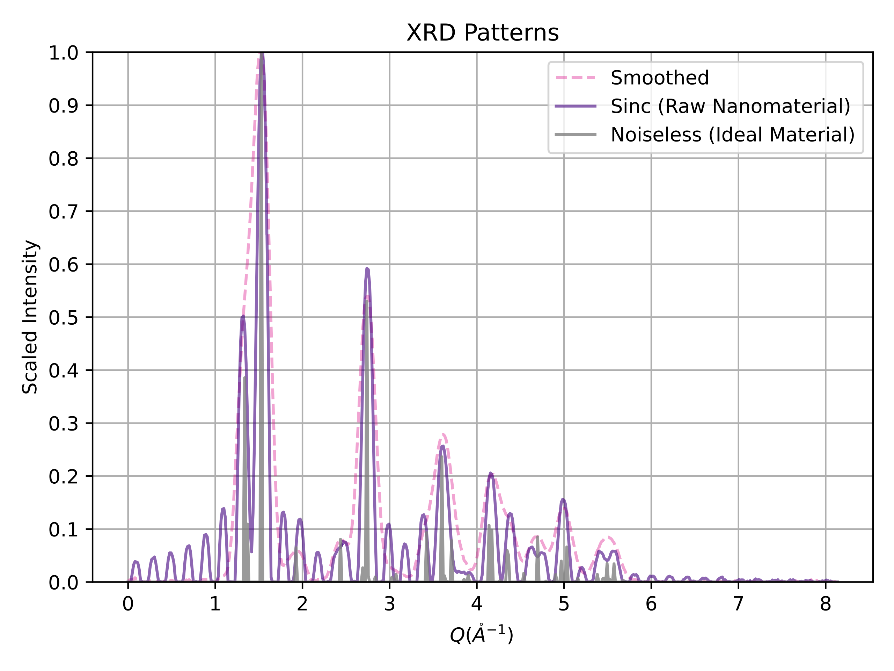
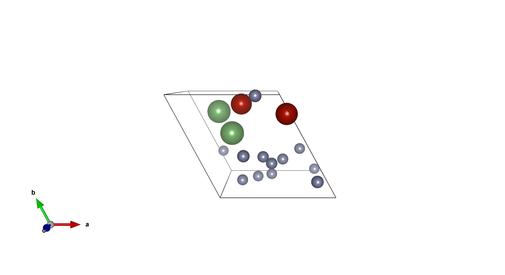
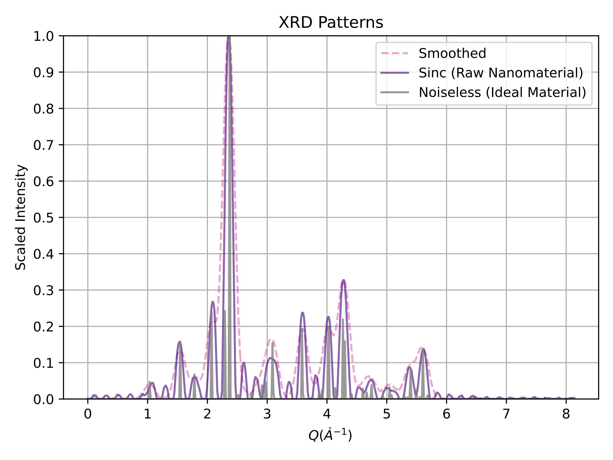
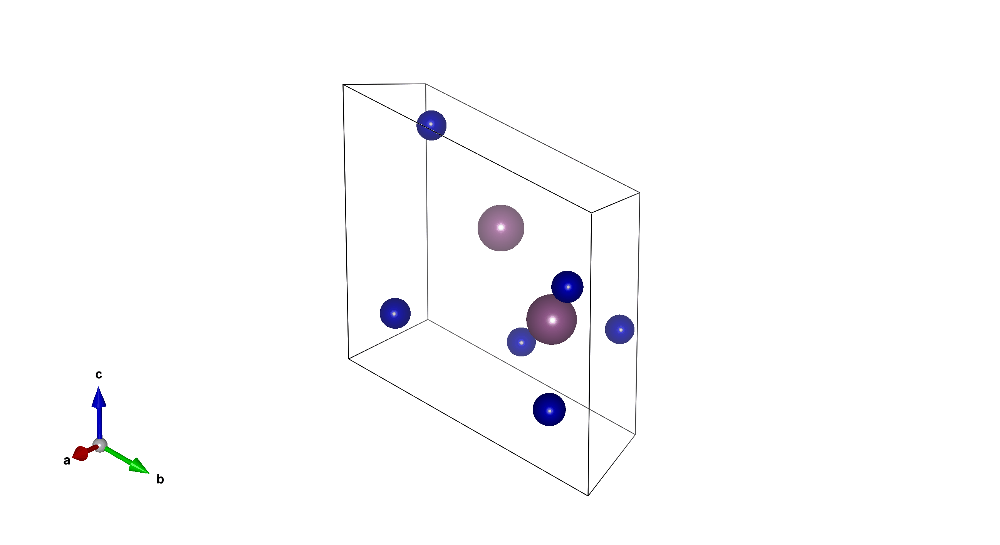

# *XRDnet*: *Ab Initio* Nanostructure Solutions from PXRD via Score-Based Generative Modeling

This is the repository for *XRDnet*, the world's first end-to-end nanostructure solver from powder x-ray diffraction (PXRD) patterns. Associated article: [Ab Initio Structure Solutions from Nanocrystalline Powder Diffraction Data via Deep Generative Modeling](https://arxiv.org/abs/2406.10796).

All code blocks assume you start from this directory.

Much thanks to [CDVAE](https://github.com/txie-93/cdvae).

## Visualization of Process

<p><b>Li<sub>2</sub>V<sub>2</sub>F<sub>12</sub></b></p>
<p align="center">
    
    
</p>

<p><b>Tm<sub>6</sub>Sc<sub>2</sub></b></p>
<p align="center">
    
    
</p>

## Requirements

Use Python 3.9.18 with Linux.

In our experience, depending on the system, you may have trouble with:
- [PyTorch Scatter](https://github.com/rusty1s/pytorch_scatter)
- [PyTorch Sparse](https://github.com/rusty1s/pytorch_sparse)

If so, just follow the instructions on their GitHub repos to install the versions that align with your CUDA version. Here are the suggested ways to do so:

```
pip install torch==2.0.0
pip install torch-scatter -f https://data.pyg.org/whl/torch-2.0.0+${CUDA}.html
pip install torch-sparse -f https://data.pyg.org/whl/torch-2.0.0+${CUDA}.html
```

After that, run the following command to install remaining requirements.

```
pip install -r requirements.txt
```

Setup environment variables by making a copy of the `.env.template` file and rename it to `.env`. Modify the following environment variables in `.env`.

- `PROJECT_ROOT`: path to the folder that contains this repo
- `HYDRA_JOBS`: path to a folder to store hydra outputs
- `WABDB`: path to a folder to store wabdb outputs

Finally, install this package with
```
pip install -e .
```

This process, if done correctly, should take less than an hour.

## Pre-Trained Model Weights

You can find our trained model weights on [Huggingface](https://huggingface.co/therealgabeguo/cdvae_xrd_sinc10). 

## Data Procurement

### Use Our Data

See `data/mp_20` for *MP-20-PXRD*, our modification of MP-20 with PXRD patterns (no broadening added).

See `data/experimental_data` for instructions on obtaining the crystal structures with experimentally observed PXRD patterns (we do not own them; [IUCr](https://www.iucr.org/resources/data/databases) does).

Despite the filenames, they're not .csv  files (they're pickle files), because the data contains PyTorch tensors.

No other action needs to be taken on data, as the scripts automatically load the datasets.

### Generate It Yourself

This is unnecessary for MP-20, because we already have created and uploaded the datasets for you. However, if you wish to try something new on the MP-20 dataset (let's say, different wavelengths or data splits), you can follow these instructions.

Before running, replace `/home/gabeguo/` in `create_data.sh` with your home directory. This takes less than an hour.

```
cd scripts
bash create_data.sh
```

Data should be saved in `data/mp_20`. 

## Training

This trains the $10 &#8491$ and $100 &#8491$ models. They will be saved under `../hydra/singlerun/[today's date]`. 

On a single GeForce RTX 3090 (24 GB), each model should take about one day to train.

```
cd scripts
CUDA_VISIBLE_DEVICES=x bash train_mp20_model_sinc10.sh
CUDA_VISIBLE_DEVICES=x bash train_mp20_model_sinc100.sh
```

## Evaluation

You will have to change `--model_path` inside each script to have the appropriate home directory (rather than `/home/gabeguo/`) and date (rather than `2024-04-07`). 

On a single GeForce RTX 3090 (24 GB), each evaluation (per model) should take about one day to conduct.

### MP-20

#### *XRDnet*

```
cd scripts
CUDA_VISIBLE_DEVICES=x bash conditional_generation_sinc10.sh
CUDA_VISIBLE_DEVICES=x bash conditional_generation_sinc100.sh
```

#### *Semi-Random Baseline*

```
cd scripts
CUDA_VISIBLE_DEVICES=x bash conditional_generation_random_baseline_sinc10.sh
CUDA_VISIBLE_DEVICES=x bash conditional_generation_random_baseline_sinc100.sh
```

#### *Latent Space Search Baseline*
```
cd scripts
CUDA_VISIBLE_DEVICES=x bash conditional_generation_sinc10_baseline_noOpt.sh
CUDA_VISIBLE_DEVICES=x bash conditional_generation_sinc100_baseline_noOpt.sh
```

### Experimentally Collected Data

#### Getting Correct Configs

Your file directory should look something like this:
```
cdvae_xrd/
  ... [some stuff here] ...
hydra/singlerun/
  [whatever date you trained model on]/
    mp_20_sinc10/
      .hydra/
        config.yaml
        hydra.yaml
        overrides.yaml
      hparams.yaml
      ... [other stuff here] ...
    mp_20_sinc100/
      ... [same stuff here] ...
```

Run the following code (assuming you are in `cdvae_xrd`) to create the proper evaluation setup for experimental data:
```
cd ../hydra/singlerun/[whatever date you trained model on]
cp mp_20_sinc10 mp_20_sinc10_EXPERIMENTAL_TEST
```

Now, go into `mp_20_sinc10_EXPERIMENTAL_TEST/.hydra/config.yaml` and change line 7 to be:
```
root_path: ${oc.env:PROJECT_ROOT}/data/experimental_xrd
```
from
~~root_path: ${oc.env:PROJECT_ROOT}/data/mp_20~~

Do exactly the same change for `mp_20_sinc10_experimental/hparams.yaml`.

#### Running the Evals

Again, remember to change `--model_path` inside each script to have the appropriate home directory (rather than `/home/gabeguo/`) and date (rather than `2024-04-07`). 

This should only take a few hours at most, due to there being fewer experimental PXRD patterns.

```
cd scripts
CUDA_VISIBLE_DEVICES=x bash conditional_generation_experimental.sh
CUDA_VISIBLE_DEVICES=x bash conditional_generation_baseline_noOpt.sh
CUDA_VISIBLE_DEVICES=x bash conditional_generation_random_baseline_experimental.sh
```

### Getting R-Factors

As before, in the `__main__` part, change the home directory from `/home/gabeguo/` to whatever your home directory is. 

This should take less than an hour.

```
cd scripts
python calculate_xrd_patterns_post_hoc.py
python calculate_r_factor_post_hoc.py
bash calc_r_value_distribution.sh
```

### Calculating Results by Crystal System

Reiterating (as you've already guessed), in `extract_results_by_crystal_system.sh`, change the home directory from `/home/gabeguo/` to whatever your home directory is. 

This should take less than an hour.

```
cd scripts
bash extract_results_by_crystal_system.sh
```

## Citation

If you find the code in this repository helpful, please cite the following:

```
@article{guo2024diffusion,
  title={Ab Initio Structure Solutions from Nanocrystalline Powder Diffraction Data},
  author={Guo, Gabe and Saidi, Tristan and Terban, Maxwell and Valsecchi, Michele and Billinge, Simon JL and Lipson, Hod},
  journal={arXiv preprint arXiv:2406.10796},
  year={2024}
}
```
